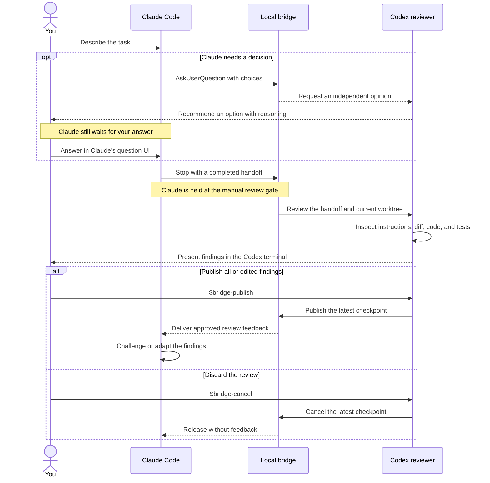

# Claude-Codex Review Bridge

**Give Claude Code an independent Codex reviewer while you stay in control of
what gets sent back.**

The bridge pauses completed Claude Code handoffs, asks a persistent Codex thread
to inspect the real worktree read-only, and lets you publish, edit, or discard
the findings. It also sends Claude's structured `AskUserQuestion` prompts to
Codex for a second opinion while Claude waits for you to answer. Each application
gets its own isolated reviewer home, so policies, memories, credentials, and
sessions never mix between projects.

[](https://github.com/uzi0espil/Codex-Claude-Reviewer-Bridge/actions/workflows/ci.yml)
[](https://www.npmjs.com/package/claude-codex-review-bridge)
[](https://github.com/uzi0espil/Codex-Claude-Reviewer-Bridge/releases)
[](LICENSE)


[Getting started](docs/bootstrap-an-application.md) ·
[Review workflows](docs/review-workflows.md) ·
[Architecture](docs/architecture.md) ·
[Security](.github/SECURITY.md) ·
[Contributing](.github/CONTRIBUTING.md)

## Why use a separate reviewer?

An agent reviewing its own work can repeat the assumptions that caused a defect.
Copying handoffs into a second chat loses project context, while a fully
automatic agent loop can act before you have evaluated its advice.

The bridge gives you:

- **Independent review.** Codex checks Claude's handoff against repository
  instructions, specifications, code, tests, and the current diff.
- **Persistent context.** One Codex thread follows each workstream instead of
  starting from a pasted summary every time.
- **Human-controlled feedback.** Manual mode holds Claude until you publish or
  cancel the review; automatic mode is explicit and can be unlimited or bounded.
- **A second opinion on decisions.** When Claude asks a structured question,
  Codex reviews the choices and advises you; only you answer Claude.
- **Project isolation.** Every application has a sibling reviewer with its own
  Codex home, policy, credentials, state, memories, and sessions.
- **Evidence-driven checks.** Reviews can use live web research, optional
  Playwright browser inspection, and user-approved validation tools discovered
  from the application's actual languages, manifests, CI, scripts, and Compose
  configuration.

## How it works

Manual mode adds two independent checkpoints to the normal Claude workflow:
advice when Claude needs your decision, and a review gate when Claude considers
its work complete.



In the diagram, `opt` marks an optional interaction and `alt` groups mutually
exclusive outcomes.

Question advice never answers Claude automatically: Claude remains in its own
question UI until you personally choose. Likewise, a completed review does not
return to Claude until you explicitly publish it; you may edit the findings or
cancel them entirely.

## Quick start

You need Git, Node.js 22 or newer, and the `claude` and `codex` CLIs. PowerShell
5.1+ and Bash are supported. [`just`](https://just.systems/) 1.52+ is optional.

### 1. Create a reviewer for your application

On Windows:

```powershell
npx --yes claude-codex-review-bridge@latest create `
  --project-root 'C:\dev\MyApp'
```

On macOS or Linux:

```bash
npx --yes claude-codex-review-bridge@latest create \
  --project-root /home/me/dev/MyApp
```

The default destination is a sibling directory:

```text
dev/
|-- MyApp/
`-- MyApp-reviewer/
```

The npx command is only a bootstrapper. It clones the matching published release
into the sibling reviewer, binds and tests it, authenticates its dedicated Codex
home, and opens guided workflows for a private application review policy and a
curated validation-tool manifest. Detection is advisory; no discovered command
becomes executable until you approve the complete manifest. No reviewer state
remains in the npm cache. Keep the reviewer beside the application, never inside
it.

During tool initialization, you also choose how readiness is established. The
safe default performs static checks and leaves container commands marked as
needing a runtime probe. You may explicitly trust runtime prerequisites globally
or approve fixed, bounded probes for selected tools. Readiness reports preserve
whether each result came from static evidence, user trust, or an executed probe.

### 2. Start a workstream

Run this from the generated reviewer:

```powershell
.\scripts\powershell\reviewer.ps1 start-pair --feature 'api-retry'
```

```bash
./scripts/shell/reviewer.sh start-pair --feature api-retry
```

The launcher opens two terminals—or prints their commands when a graphical
terminal is unavailable—one for Claude and one for Codex. Work normally in
Claude. If Claude uses `AskUserQuestion`, its question and choices appear in
Codex for advice while Claude waits for your answer. When Claude finishes,
inspect the read-only review in Codex and choose:

- `$bridge-publish` to send the findings to Claude;
- `$bridge-cancel` to release Claude without feedback.

See [Getting started](docs/bootstrap-an-application.md) for custom destinations,
private template forks, the factory-checkout alternative, authentication
recovery, terminal fallbacks, validation, and updates.

## Choose a review mode

New workstreams use the reviewer instance's default mode, which is `manual` on
new and upgraded installations. Change that default without invoking either
agent:

```bash
./scripts/shell/reviewer.sh default-mode auto
```

On Windows, use `.\scripts\powershell\reviewer.ps1 default-mode auto`. The
accepted defaults are `manual`, `auto`, and `off`; default `auto` uses unlimited
unattended rounds. The setting is stored as `defaultMode` in
`bridge.local.json`, so it can also be edited directly. It applies only when a
previously unseen feature name is first paired; existing workstreams keep their
current mode.

Change the current workstream's mode from its paired Codex thread:

| Mode | Command | Behavior |
| --- | --- | --- |
| Manual | `$bridge-manual` | Review every Claude Stop and wait for your publish or cancel decision. |
| Once | `$bridge-once` | Review the next Stop, then turn interception off after your decision. |
| Automatic | `$bridge-auto [rounds]` | Allow automatic review, revision, or already-authorized continuation rounds, optionally bounded per cycle. |
| Off | `$bridge-off` | Disable Stop interception and question advice. |

Use `$bridge-status` to inspect routing and checkpoint state. The live report
contains every checkpoint created for the feature during the current bridge
server session, regardless of mode, without invoking either model:

```text
just report api-retry
```

The initial prompt's first meaningful line appears as the report subject, and
Codex responses are included by default. Add `--full` to include the complete
initial request and the Claude handoff captured for every checkpoint. The
in-memory checkpoint history is discarded when the bridge server stops.

While the bridge is off, it retains only Claude's latest completed assistant
handoff. Use `$bridge-pull-review` for a one-off Codex opinion that stays between
you and the reviewer, or arm manual, once, or auto mode and use
`$bridge-pull-queue` to process that handoff through the checkpoint flow. Because
the off-mode Stop has already completed, queued feedback reaches Claude on your
next submitted prompt; automatic mode continues normally after that handoff.

See [Review workflows](docs/review-workflows.md) for all bridge skills,
automatic controls, question advisories, live reporting, and recovery.

## What stays under your control

- Hook-injected Codex reviews select the read-only `bridge-review` permission
  profile and never request approval to modify the application.
- Generated native Windows configuration selects Codex's `unelevated` sandbox
  fallback, so read-only commands work without administrator-approved sandbox
  setup. WSL, macOS, and Linux continue to use their native sandbox backends.
- Manual publication is bound to the latest checkpoint, preventing stale
  feedback from being sent to newer work.
- The broker listens on an ephemeral loopback port protected by a random bearer
  token stored in ignored runtime state.
- The application-specific policy stays in the ignored reviewer file
  `review-policy.local.md`; it is not added to the application or public factory.
- Scanner recommendations and approved application tools stay in ignored
  reviewer files. The fixed manifest writer is prompt-gated and approved tools
  use argv execution without shell interpolation.
- Readiness policy is user-approved in the same manifest. Trusted readiness
  cannot suppress structural failures, and runtime probes are fixed capabilities
  rather than arbitrary shell access.
- Interactive implementation access is a separate, explicit permission profile
  and does not weaken injected reviews.

This is workflow isolation, not an operating-system security boundary. Claude
and Codex still run as the same operating-system user. Read the
[architecture](docs/architecture.md) and [security policy](.github/SECURITY.md)
before relying on the bridge for sensitive work.

> [!NOTE]
> The bridge uses Codex's experimental remote app-server protocol. Checkpoint
> reports are held only in broker memory and are unavailable after the server
> stops.

## Documentation

- [Getting started](docs/bootstrap-an-application.md) — create, validate, and
  update an isolated reviewer.
- [Review workflows](docs/review-workflows.md) — modes, skills, reports,
  question advice, and recovery.
- [Architecture](docs/architecture.md) — routing, concurrency, persistence, and
  security boundaries.
- [Contributing](.github/CONTRIBUTING.md) — development checks and release
  process.
- [Security](.github/SECURITY.md) — supported versions and private vulnerability
  reporting.

## Help and feedback

Use [GitHub Issues](https://github.com/uzi0espil/Codex-Claude-Reviewer-Bridge/issues)
for bugs and feature requests. Report security vulnerabilities through
[private vulnerability reporting](https://github.com/uzi0espil/Codex-Claude-Reviewer-Bridge/security/advisories/new),
not a public issue.

## License

Licensed under the Apache License, Version 2.0. See [LICENSE](LICENSE).
