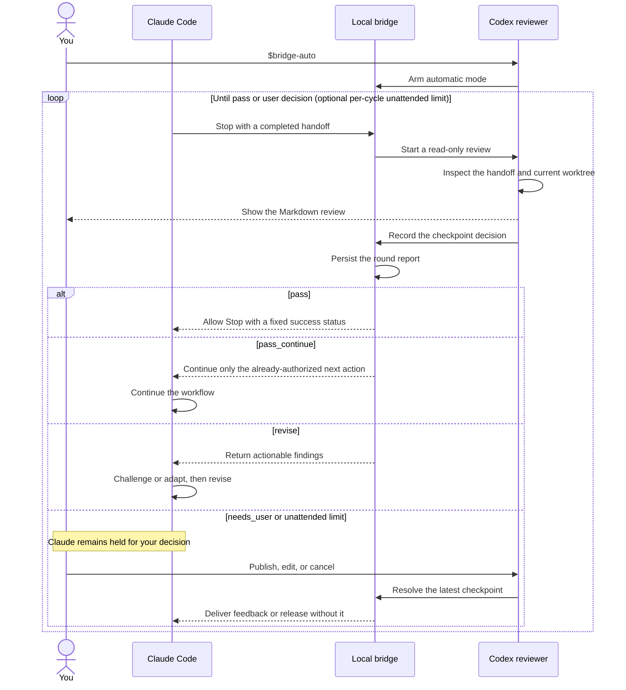

# Review workflows

The bridge keeps one Claude session and one persistent Codex thread paired to a
feature name. Use one feature name for one task, and create a new name for
unrelated work in the same application.

## The normal review loop

1. Give Claude the product or implementation task.
2. Claude produces a design, implementation, or verification handoff.
3. Its Stop hook starts a read-only review in the paired Codex thread.
4. Inspect the review and run `$bridge-publish` or `$bridge-cancel`.
5. Continue the workstream; manual mode remains armed for the next handoff.

Codex treats the worktree as authoritative. Claude's latest message is a handoff,
not a substitute for reading repository instructions, specifications, code,
tests, and diffs.

## Review modes

### Manual

`$bridge-manual` is the default. Every Claude Stop starts a review and remains
held until you make a decision:

- `$bridge-publish` sends the completed review, or your edited selection, to
  Claude.
- `$bridge-cancel` releases Claude without feedback.

Both decisions leave manual mode armed. A held Stop can remain open while you
read or discuss the review; the hook response streams without polling.

### Once

`$bridge-once` arms only the next review. After you publish or cancel that
checkpoint, the bridge returns to off mode.

### Automatic

`$bridge-auto` keeps automatic review armed with unlimited unattended rounds.
Pass a positive integer, such as `$bridge-auto 2`, to bound unattended revision
or continuation deliveries per cycle. Each checkpoint ends in one of four
outcomes:

- `pass` releases a complete and clean workflow;
- `pass_continue` resumes one concrete next action that the user already
  authorized;
- `revise` returns actionable findings to Claude;
- `needs_user` pauses for a decision or unavailable required validation.



Here, `loop` marks the part that can repeat and `alt` shows the mutually
exclusive decision outcomes.

Revision and continuation share the configured unattended-round counter. With
no argument the counter is unlimited; a positive integer limits how many such
deliveries may occur before the bridge pauses for the user. The bridge cannot
use continuation to create authorization or broaden the task. A final pass or a
human publish or cancel decision resets the unattended counter without
disarming automatic mode.

Automatic responses remain ordinary Markdown in the Codex terminal. Each round
is also saved under ignored `reviews/` so the complete latest cycle can be
assembled without adding another model turn:

```text
just report your-feature-name
```

Without Just:

```powershell
.\scripts\powershell\reviewer.ps1 report --feature 'your-feature-name'
```

```bash
./scripts/shell/reviewer.sh report --feature your-feature-name
```

### Off

`$bridge-off` disables Stop interception and structured-question advice. If a
Stop is currently held, turning the bridge off releases it without feedback.

## Bridge commands

| Command | Purpose |
| --- | --- |
| `$bridge-init-policy` | Create or refresh the private application review policy. |
| `$bridge-manual` | Review every completed Claude handoff with human approval. |
| `$bridge-once` | Review only the next completed handoff. |
| `$bridge-auto [rounds]` | Arm unlimited automatic review, or bound unattended deliveries per cycle with a positive integer. |
| `$bridge-off` | Disable interception and question advice. |
| `$bridge-status` | Show mode, pairing, pending checkpoint, and recovery state. |
| `$bridge-publish` | Publish the latest completed checkpoint review. |
| `$bridge-cancel` | Release the latest checkpoint without feedback. |
| `$bridge-force-publish` | Queue feedback only when recovering with no held Stop. |

Published feedback is advisory. Claude is instructed to challenge or adapt it
against project evidence rather than accept it blindly.

## Structured question advice

When Claude calls `AskUserQuestion`, the bridge mirrors the structured question
and choices into the same Codex thread for read-only advice. Claude continues to
wait in its own question UI. Discuss the recommendation in Codex, then personally
submit the final selection to Claude.

Question advisories are not checkpoints and cannot be published. If Codex is
busy, advice is queued; a later Claude Stop discards obsolete queued advice and
prioritizes the newer review.

## Checkpoints and newer handoffs

Only one unpublished checkpoint can be current for a feature. If Claude finishes
again while a review is pending, the newer checkpoint wins: the bridge releases
the obsolete Stop, interrupts the obsolete review, and reassesses the current
worktree. Publish and cancel operations require the exact latest checkpoint, so
stale decisions are rejected.

## Status and recovery

Run `$bridge-status` when a review does not appear, Claude remains held, or
routing is unclear. It reports the feature's mode, immutable session and thread
IDs, pending checkpoint, queued question advice, and queued next-prompt feedback.

Normal publication uses `$bridge-publish`. Reserve `$bridge-force-publish` for
recovery after a restart, cancelled checkpoint, disconnected Stop hook, or a
manually pasted handoff when no Stop is held. Recovery feedback is delivered on
Claude's next user prompt.

For broker-level diagnosis, inspect ignored `runtime/bridge.log`. See
[Architecture](architecture.md) for routing, concurrency, persistence, and the
security model.
